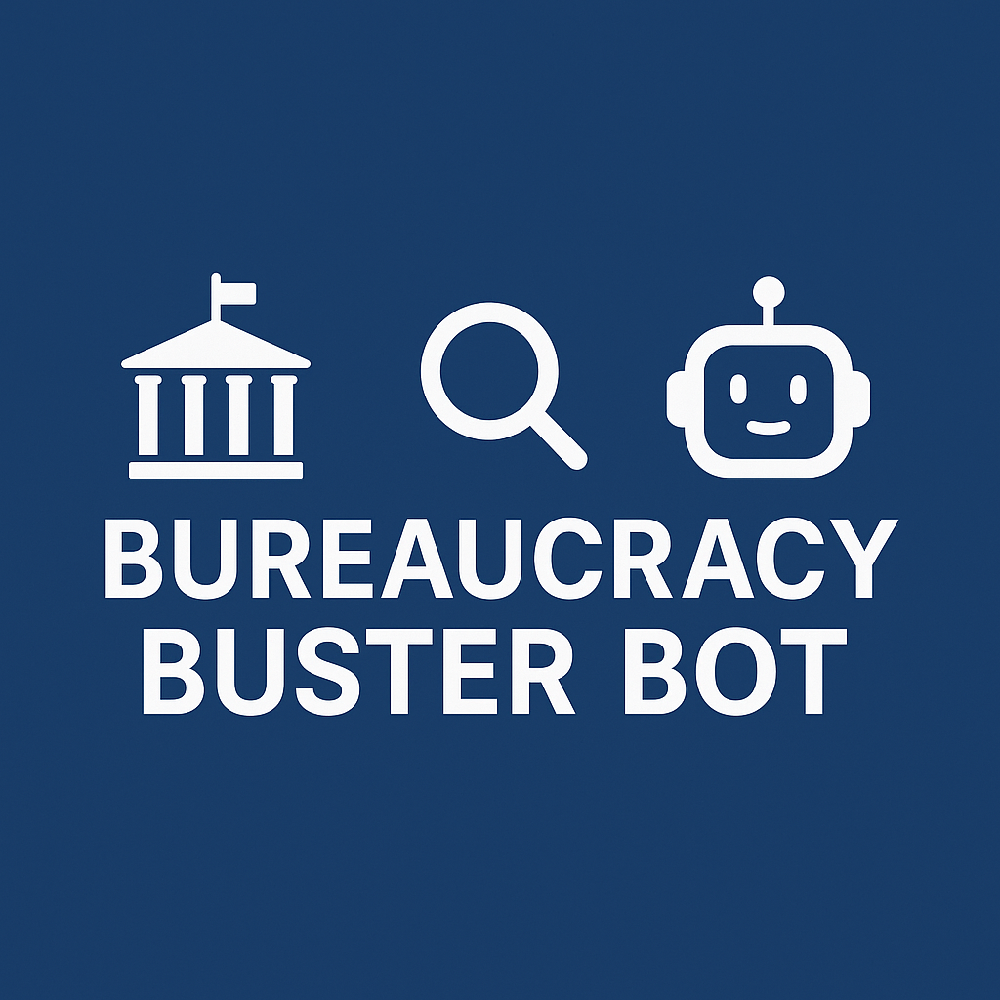

<div align="center">
  
  
  <h1>🏛️ Bureaucracy Buster Bot</h1>
  
  <p>
    <em>Ваш AI-ассистент по Гражданскому кодексу РФ</em>
  </p>
  

</div>

## 🌟 Особенности

- 📚 **Умный поиск** по Гражданскому кодексу РФ с векторной индексацией
- 💬 **Человекочитаемые ответы** с генерацией от GPT-4
- 🤖 **Удобный Telegram-интерфейс**
- ⚡ **Быстрая обработка** запросов благодаря FAISS

## 🚀 Быстрый старт

### Предварительные требования
- Python 3.11+
- Poetry 1.6+
- API ключи (см. ниже)

### Установка
```bash
git clone https://github.com/edvardvet/the-bureaucracy-buster-bot.git
cd the-bureaucracy-buster-bot
poetry install
```

### Настройка окружения
Создайте файл .env в корне проекта:

TELEGRAM_TOKEN=your_telegram_bot_token
OPENAI_API_KEY=your_openai_key
PROXY_URL=your_proxy_if_needed
LANGCHAIN_API_KEY=your_langchain_key

### Запуск
poetry run python src/main.py


## 📌 Цели проекта
🔍 Автоматизация юридических справок по законодательству РФ

🧠 Практика работы с современными NLP-технологиями:
1.Vector Search
2.RAG (Retrieval-Augmented Generation)
3.LangGraph для сложных workflow

🎓 Портфолио с проектом, имеющим практическую ценность

<div align="center"> <sub>Создано с ❤️ для борьбы с бюрократией</sub> </div>